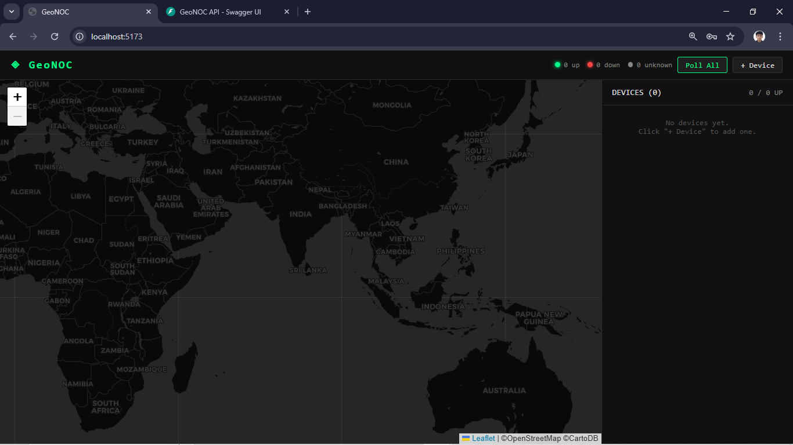
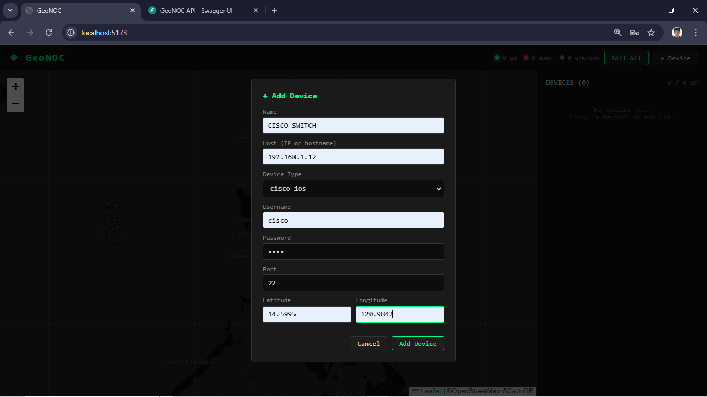
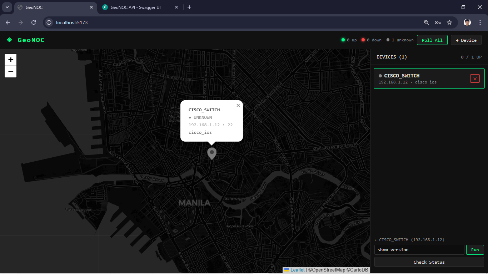
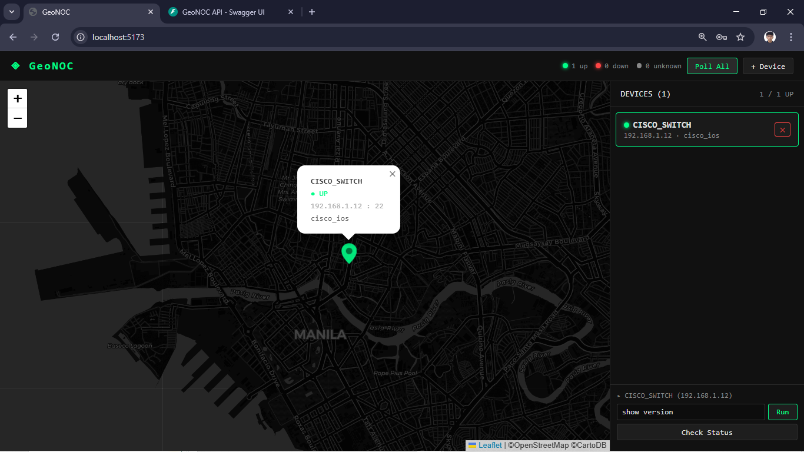
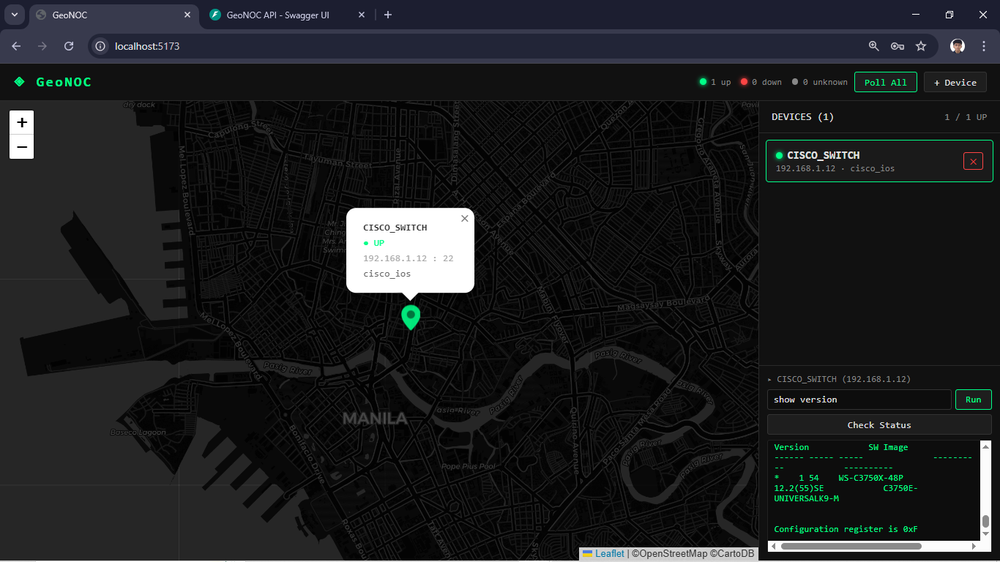
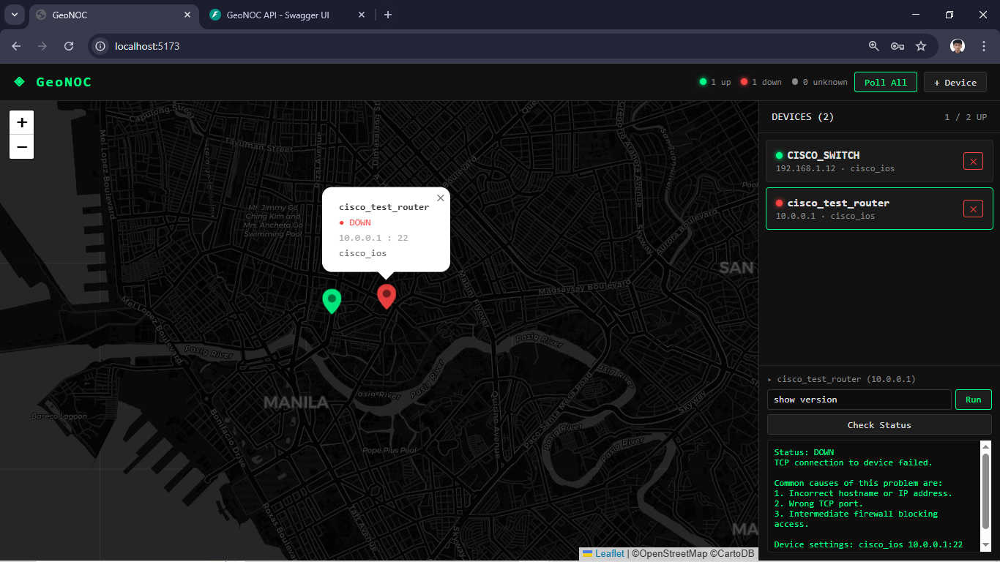

# GeoNOC

GeoNOC is a network monitoring system that enables a Network Operations Center (NOC) to visualize vendor appliances such as **Cisco**, **Huawei**, and **Nokia** on a geographical map. It provides real-time monitoring of network health and operational status.

---

### Personal Note

This is a personal hobby project born out of curiosity. I'm exploring tools and workflows that I can apply to real-world scenarios or my daily work. It's a sandbox for me to test new tech, visualization methods, and network integrations.

I am also leveraging AI-assisted development to accelerate the coding process, prototype features quickly, and bridge gaps in new technologies I am exploring.

**Disclaimer**: Since this is an experimental sandbox, please expect that the source code may not be clean and could contain vulnerabilities. All testing and development are conducted in a **localhost environment** only.

---

## Screenshots

### Dashboard

### Add Device

### Device on Map

### Poll All Devices

### Run Commands

### Check Status

---

## Tech Stack

| Layer | Technology |
|-------|-----------|
| Frontend | React 18, Vite, Leaflet |
| Backend | FastAPI, Uvicorn, Netmiko |
| Database | SQLite, SQLAlchemy |
| Containerization | Docker, Docker Compose |

---

## Features

- **Geo Map** — visualize all network devices on a world map with color-coded status markers
- **Add Device** — dynamically add routers and switches with SSH credentials and geo coordinates
- **Poll All** — trigger SSH connection checks across all devices at once via Netmiko
- **Check Status** — poll a single device and see live status update on the map
- **Run Commands** — send CLI commands (e.g. `show version`) directly to devices and see output
- **Auto-refresh** — device list refreshes every 15 seconds automatically

---

# Changelog

All notable changes to this project will be documented below.

## [Unreleased]
### In Progress
- Interface status view per device (name, status, IP, speed/duplex)
  - Supported vendors: Cisco IOS, Cisco NX-OS, Cisco XR, Huawei, Nokia
  - Accessible via "Interfaces" button per device
  - Displays in a modal/popup
- Device edit functionality (update credentials, IP, location)

## [0.2.0] - 2026-03-15
### Added
- Frontend scaffolded with React 18 + Vite
- Leaflet geo map with dark CartoDB tiles
- Color-coded device markers (green = up, red = down, grey = unknown)
- Device side panel with live status indicators
- Add Device modal with form validation
- Command runner UI — send CLI commands to devices via Netmiko
- Check Status button — poll individual device SSH reachability
- Poll All button — SSH check across all devices at once
- Auto-polling every 15 seconds
- Vite proxy config routing frontend requests to backend container

## [0.1.0] - 2026-03-15
### Added
- Project structure scaffolded (`backend/`, `frontend/`, `docker-compose.yml`)
- Docker setup with two containers (`geonoc-backend`, `geonoc-frontend`) on a shared internal network
- Backend bootstrapped with FastAPI + Uvicorn
- Netmiko integration for SSH connectivity to network devices (Cisco, Huawei, Nokia)
- SQLite database with SQLAlchemy ORM
- Device model with fields: name, host, device_type, username, password, port, lat/lon, status, last_checked
- REST API routes:
  - `GET/POST /devices/` — list and create devices
  - `GET/PUT/DELETE /devices/{id}` — manage individual devices
  - `GET /connect/poll/{id}` — poll device SSH status
  - `GET /connect/poll-all` — poll all devices at once
  - `POST /connect/command/{id}` — run CLI commands via Netmiko
- `.gitignore` and `.dockerignore` files for backend and frontend
